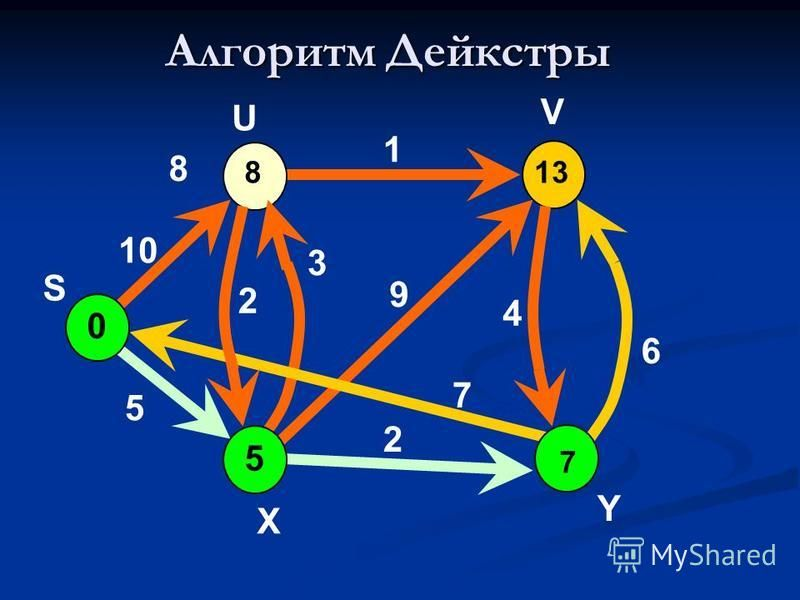

# Алгоритмы и структуры данных
1. [Графы](#графы) 
    1.1 [Поиск в глубину](#поиск-в-глубину)
    1.2 [Поиск в ширину](#поиск-в-ширину)
    1.3 [Алгоритм Дейкстры](#алгоритм-дейкстры)
2. [Поиск](#поиск)  
    2.1 [Линейный поиск](#линейный-поиск)  
    2.2 [Бинарный поиск](#бинарный-поиск)  
    2.3 [Тернарный поиск](#тернарный-поиск)  
3. [Сортировки](#сортировки)    
    3.1 [Count sort O(N)](#count-sort-on)
    3.2 [Quick sort O(N*logN)](#quick-sort-onlogn)
    3.3 [Merge sort O(N*logN)](#merge-sort-onlogn)
    3.4 [Heap sort O(N*logN)](#heap-sort-onlogn)
    3.5 [Bubble sort O(N^2)](#bubble-sort-on2)
    3.6 [Selection sort O(N^2)](#selection-sort-on2)
4. [Строки](#cтроки)    
    4.1 [Z-функция](#z-function)
    4.2 [Префикс-функция](#prefix-function)
    4.3 [Бор](#бор)
    4.4 [Суф. массив за O(N*logN)](#суффиксный-массив-за-onlogn)
5. [Структуры данных](#cтруктуры-данных)    
    5.1 [Дерево отрезков](#дерево-отрезков)
    5.2 [Дерево Фенвика](#дерево-фенвика)
    
## Графы  


  
### Поиск в глубину
Рекурсивный алгоритм обхода вершин графа.
Предполагает продвижение вглубь до тех пор, пока это возможно.

Псевдокод:
```
for vertex: Graph
    if (vertex.notUsed() {
        dfs(vertex)
    }

dfs(vertex) {
    //Действия с вершиной
    vertex.setUsed();
    for related: vertex.allRelated()
        if (related.notUsed()) {
            dfs(related)
        }
}
```
Таким образом, мы вызываем рекурсивную функцию в цикле из всех вершин графа.
Благодаря этому алгоритм будет работать даже если граф несвязный, имеет несколько
компонент связности. 
Перед вызовом рекурсивной функцией у вершины, мы всегда проверяем,
что она ещё не была пройдена в процессе обхода (vertex.notUsed()).

Асимптотическая сложность алгоритма составляет O(N+M), где
N - число вершин в графе, а
M - суммарное число рёбер в графе.

[Реализация](src/main/java/ru/job4j/algo/graph/dfs/DFS.java)
[Тест](src/test/java/ru/job4j/algo/graph/dfs/DFSTest.java)

Задачи, которые можно решать с помощью DFS:
* Поиск любого пути в графе
* Поиск лексикографически первого пути в графе
* Проверка, является ли одна вершина предком другой(запоминаем время входа и выхода в dfs для каждой вершины)
* Топологическая сортировка графа
* Проверка графа на ацикличность
* Поиск компонент сильной связности в ориентированном графе

### Поиск в ширину
Алгоритм для обхода графа, который отличается от DFS.
При таком обходе мы сначала перебираем все вершины, которые прямо смежны
с корневой, далее те, расстояние которых до корневой = 2 и тд
(под расстоянием тут понимаем длину пути, считая длину каждого ребра равной 1)

1. Добавляем корневую вершину в очередь и помечаем её как пройдённую
2. Пока очередь не пуста, выполняем следующие действия:
    * Достаём вершину из головы очереди
    * Выполняем с ней действия, необходимые в конкретной ситуации,
      для которой производится обход графа
    * Перебираем всех её соседей, и тех что не помечены как пройденные
      добавляем в хвост очереди и помечаем как пройденные

Псевдокод:
```
Queue queue = new Qeueue();
queue.add(root);
root.setUsed();
while(!queue.isEmpty()) {
    v = queue.poll();
    // Действия с вершиной v
    for related : v.allRelated() {
        if (related.notUsed()) {
            related.setUsed();
            queue.offer(related);
        }    
    }
}
```

Асимптотическая сложность алгоритма составляет O(N+M), где
N - число вершин в графе, а
M - суммарное число рёбер в графе.

Задачи, которые можно решать с помощью BFS:
* Поиск кратчайшего пути между двумя вершинами в невзвешенном графе
* Поиск компонент связности графа

[Реализация](src/main/java/ru/job4j/algo/graph/bfs/BFS.java)
[Тест](src/test/java/ru/job4j/algo/graph/bfs/BFSTest.java)

### Алгоритм Дейкстры




Алгоритм поиска кратчайших путей во взвешенном графе с неотрицательными весами рёбер.
Расстояния рассчитываются от некой заданной фиксированной стартовой вершины root.
1. Заводим массив d[], в котором будут храниться искомые расстояния от вершины root до каждой из
вершин графа. Изначально d{root} = 0, a для всех остальных вершин d{i}=INFINITY(бесконечности)
2. Заводим массив used[], в котором храним - помечена вершина или нет. Изначально
все вершины не помечены
3. Далее следуют n итераций. На каждой из них:
    * Выбирается вершина v с наименьшим d{v} среди непомеченных вершин
    * Вершина v помечается
    * Для каждого соседа to вершины v производится попытка уменьшить его d{to}
      значением  {d{v} + len(v, to) }, где len(a,b) - вес ребра (a, b)
      
Асимптотическая сложность алгоритма при простейшей реализации: O(N^2 + M),
т.к. перебираются все M рёбер и на каждой из N итераций производится линейный (O(N)) 
поиск вершины с минимальным d

[Реализация]()
[Тест]()
 
## Поиск

### Линейный поиск
### Бинарный поиск
### Тернарный поиск

## Сортировки

### Count sort O(N)
### Quick sort O(N*logN)
### Merge sort O(N*logN)
### Heap sort O(N*logN)
### Bubble sort O(N^2)
### Selection sort O(N^2)

## Cтроки

### Z-function
### Prefix-function
### Бор
### Суффиксный массив за O(N*logN)

## Cтруктуры данных

### Дерево отрезков
### Дерево Фенвика